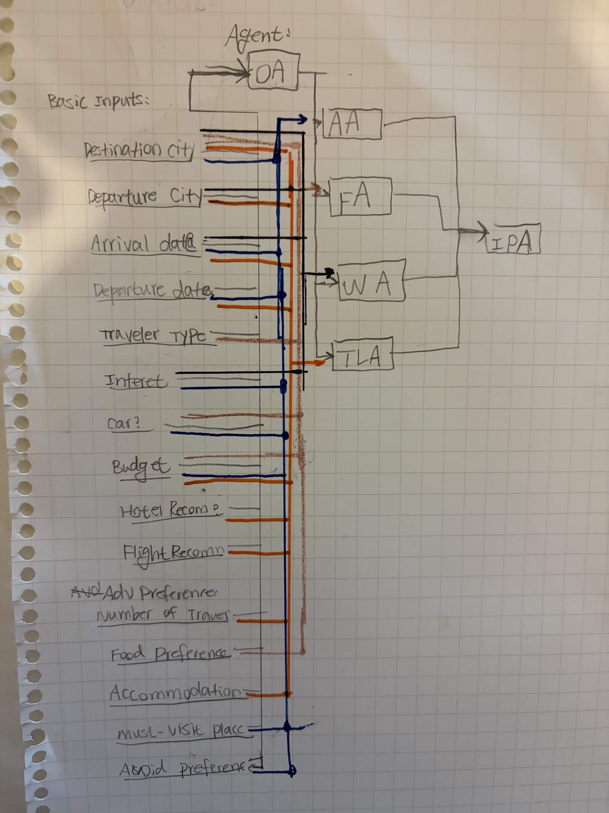
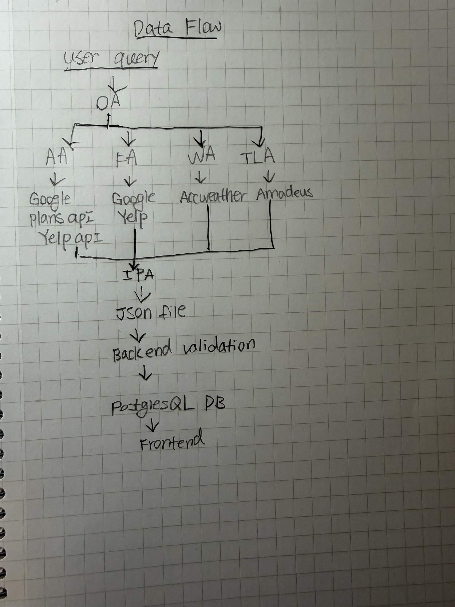
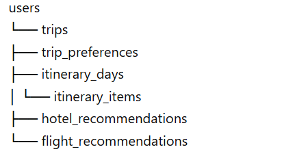

# Project Overview

AI Travel Planner is a multi-agent AI-powered system that generates personalized travel itineraries based on structured user inputs and real-time external data.

The system collects user preferences through a questionnaire, decomposes the problem into specialized tasks (attractions, food, weather, and travel logistics), and coordinates multiple AI agents to produce a structured, day-by-day travel plan.

Unlike traditional chatbots, this system functions as a decision-making engine, allowing users to not only generate itineraries but also interactively modify individual components of their travel plans.

# Problem Statement

Planning a trip is often inefficient and fragmented:

Information is scattered across platforms (Google, Yelp, blogs, social media)
Users must manually compare options and organize schedules
Existing tools lack true personalization
Generated itineraries (if any) are rigid and not editable

Users spend significant time searching, filtering, and organizing travel information, often leading to suboptimal planning.

# Solution

This project proposes a multi-agent AI travel planning system that:

Collects structured user input via a questionnaire
Uses specialized AI agents to handle different aspects of travel planning
Integrates real-time data from external APIs
Generates a complete, structured itinerary
Allows users to modify individual itinerary modules dynamically

Key innovation:

Instead of generating a static plan, the system produces a modular, editable itinerary, where each activity (attraction, restaurant, etc.) is an independent unit.

# Technology Stack / Required Tools

## Frontend
- React  
- HTML / CSS / JavaScript  
- Axios / Fetch API  

## Backend
- Python  
- FastAPI  
- Uvicorn  

## Database
- PostgreSQL  
- SQLAlchemy  
- Alembic  

## AI / LLM
- OpenAI API  

## Agent Framework
- LangGraph  
- LangChain  

## External APIs
- Google Places API  
- Yelp Fusion API  
- AccuWeather API  
- Amadeus API  

## Deployment
- Render 

# System Architecture

The system follows a 5-agent + Orchestrator architecture:

Agents:
- Orchestrator Agent
- Attraction Agent
- Food Agent
- Weather Agent
- Travel Logistics Agent
- Itinerary Planner Agent
Responsibilities:
Orchestrator distributes tasks based on user input
Specialized agents retrieve and process domain-specific data
Itinerary Planner synthesizes all outputs into a final plan

# Data Flow
The data flow illustrates how user input is processed, enriched by external APIs, and transformed into structured itinerary data stored in the database and rendered on the frontend.

# Database Design

## 1. Overview

The database is designed to support:

- User login and authentication
- Travel plan history
- Structured questionnaire storage
- Modular itinerary (editable per activity)
- Separate storage for hotel and flight recommendations

## 2. Entity Relationships

## 3. Tables

### 3.1 users

Stores user account information.

| Field | Type | Description |
|------|------|------------|
| id | SERIAL | Primary key |
| email | TEXT | User email |
| password_hash | TEXT | Hashed password |
| username | TEXT | Display name |
| created_at | TIMESTAMP | Account creation time |

---

### 3.2 trips

Stores each travel plan (supports history page).

| Field | Type | Description |
|------|------|------------|
| id | SERIAL | Primary key |
| user_id | INTEGER | Foreign key → users.id |
| title | TEXT | Trip name |
| destination_city | TEXT | Destination |
| departure_city | TEXT | Departure city |
| arrival_date | DATE | Arrival date |
| departure_date | DATE | Departure date |
| traveler_type | TEXT | Travel style |
| budget | INTEGER | Budget |
| has_car | BOOLEAN | Transportation |
| need_hotel | BOOLEAN | Hotel needed |
| need_flight | BOOLEAN | Flight needed |
| created_at | TIMESTAMP | Created time |
| updated_at | TIMESTAMP | Updated time |

---

### 3.3 trip_preferences

Stores detailed questionnaire preferences.

| Field | Type | Description |
|------|------|------------|
| id | SERIAL | Primary key |
| trip_id | INTEGER | Foreign key → trips.id |
| interests | JSONB | User interests |
| food_preferences | JSONB | Food preferences |
| accommodation_preferences | JSONB | Hotel preferences |
| must_visit_places | JSONB | Required locations |
| avoid_preferences | JSONB | Avoid items |
| group_size | INTEGER | Number of travelers |

---

### 3.4 itinerary_days

Represents each day in a trip.

| Field | Type | Description |
|------|------|------------|
| id | SERIAL | Primary key |
| trip_id | INTEGER | Foreign key → trips.id |
| date | DATE | Date |
| day_number | INTEGER | Day index |
| theme | TEXT | Day theme |
| notes | TEXT | Optional notes |

---

### 3.5 itinerary_items

Core table for modular itinerary.

Each record represents one activity (card).

| Field | Type | Description |
|------|------|------------|
| id | SERIAL | Primary key |
| trip_id | INTEGER | Foreign key → trips.id |
| day_id | INTEGER | Foreign key → itinerary_days.id |
| item_type | TEXT | attraction / restaurant / activity |
| start_time | TIME | Start time |
| end_time | TIME | End time |
| name | TEXT | Name |
| address | TEXT | Location |
| notes | TEXT | Notes |
| source_agent | TEXT | Generated by which agent |
| source_api | TEXT | API source |
| external_place_id | TEXT | External ID |
| order_index | INTEGER | Order in day |
| locked | BOOLEAN | Prevent modification |
| created_at | TIMESTAMP | Created time |
| updated_at | TIMESTAMP | Updated time |

---

### 3.6 hotel_recommendations

Stores hotel suggestions separately.

| Field | Type | Description |
|------|------|------------|
| id | SERIAL | Primary key |
| trip_id | INTEGER | Foreign key → trips.id |
| hotel_name | TEXT | Hotel name |
| address | TEXT | Location |
| price_estimate | INTEGER | Price |
| rating | FLOAT | Rating |
| notes | TEXT | Notes |
| source_api | TEXT | API source |
| external_hotel_id | TEXT | External ID |

---

### 3.7 flight_recommendations

Stores flight suggestions separately.

| Field | Type | Description |
|------|------|------------|
| id | SERIAL | Primary key |
| trip_id | INTEGER | Foreign key → trips.id |
| airline | TEXT | Airline |
| departure_airport | TEXT | Departure |
| arrival_airport | TEXT | Arrival |
| departure_time | TIMESTAMP | Departure time |
| arrival_time | TIMESTAMP | Arrival time |
| price_estimate | INTEGER | Price |
| notes | TEXT | Notes |
| source_api | TEXT | API source |

---

## 4. Key Design Decisions

- Each itinerary item is stored as an independent record to support modular editing
- JSONB is used for flexible user preferences
- Trips are stored separately to support history functionality
- Hotel and flight recommendations are stored outside the main itinerary
- Relationships are normalized for scalability and maintainability

---

## 5. Supported Features

This database design enables:

- User login and authentication
- Travel history tracking
- Viewing past travel plans
- Day-by-day itinerary structure
- Editable itinerary modules
- Replace / delete / update single activities
- Integration with external APIs

# API Design

- POST /api/trips/generate  
  Generate a new travel plan

- GET /api/trips/{trip_id}  
  Retrieve full itinerary

- PATCH /api/itinerary-items/{id}  
  Update a specific itinerary item

- POST /api/itinerary-items/{id}/replace  
  Replace a specific activity

- GET /api/trips  
  Retrieve user travel history

# UI/UX Design
The frontend presents the itinerary as modular cards.

Structure:
Organized by Day
Each activity is a card
Each card includes:
Time range
Name (attraction / restaurant)
Address
Notes
Action buttons
User Interactions:
Replace (regenerate activity)
Edit time
Delete
Lock (prevent regeneration)
Additional Sections:
Hotel recommendations (separate)
Flight suggestions (separate)

# Key Innovation

Multi-agent task decomposition architecture
Modular itinerary system (editable per activity)
Integration of real-time APIs with LLM reasoning
User-controllable AI outputs (not a black-box system)
